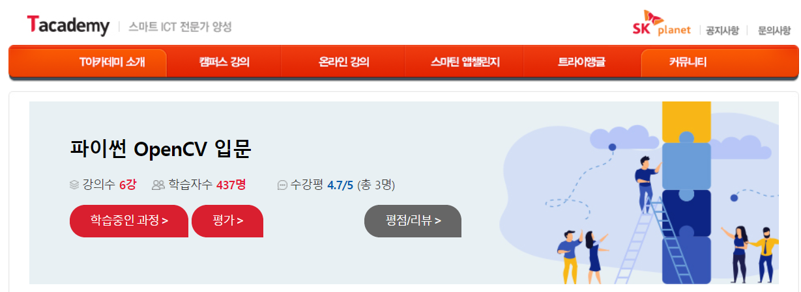

# openCV-Tacademy
- 강의 링크 : https://tacademy.skplanet.com/live/player/onlineLectureDetail.action?seq=179
  

##### 본 Repository는  T-academy openCV 입문 강의 수강 내용을 토대로 작성하였습니다.
- 다룬 내용을 크게 두가지로 나누면
  - 1. 명함 검출 및 인식 => Tessract를 활용한 명함의 문자 인식
  - 2. Pre-trained DNN 모델을 가져와서, 영상을 input으로 하여 얼굴을 검출하며, SNOW 어플과 유사하게 얼굴에 토끼 귀 스티커 사진을 합성