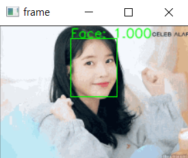

# openCV 얼굴 검출
- model : __res10_300x300_ssd_iter_140000_fp16.caffemodel__
- 입출력 형식
  - 입력 : 300x300, BGR, mean=(104,177,123)
  - 출력 : class, confidence, coordinate 드으이 저보를 담고 있는 4차원의 행렬
  - shape=(1, 1, N, 7)
- __얼굴 검출 예시__
